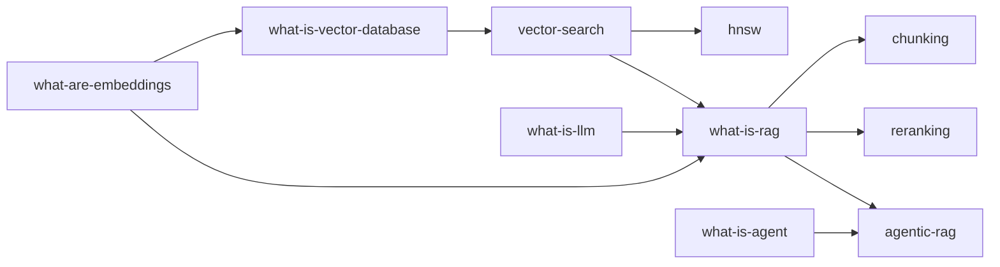

# ByHeart AI - Content Schema & Data Models

> How content, metadata, the knowledge graph, quizzes, and directories are structured - so content evolves without rewriting the app. Companion to [MASTER_PLAN.md](./MASTER_PLAN.md).

**Last reviewed:** 2026-08-30

**Core separation principle:** CONTENT (MDX prose) is independent from METADATA (typed records), VISUALS (React components), QUIZZES (structured data), and VOLATILE DATA (models/tools). Each can change on its own cadence.

---

## Table of contents

- [1. Overview of entities](#1-overview-of-entities)
- [2. Concept metadata schema](#2-concept-metadata-schema)
- [3. Knowledge-graph relationship model](#3-knowledge-graph-relationship-model)
- [4. Lesson MDX + front-matter](#4-lesson-mdx--front-matter)
- [5. The 18-part lesson template](#5-the-18-part-lesson-template)
- [6. Quiz schema](#6-quiz-schema)
- [7. Learning path schema](#7-learning-path-schema)
- [8. Glossary schema](#8-glossary-schema)
- [9. Model directory schema (volatile)](#9-model-directory-schema-volatile)
- [10. Tool directory schema (volatile)](#10-tool-directory-schema-volatile)
- [11. Visual/simulator registry](#11-visualsimulator-registry)
- [12. Content lifecycle & versioning](#12-content-lifecycle--versioning)
- [13. Content validation rules (build gate)](#13-content-validation-rules-build-gate)
- [14. Internationalization readiness](#14-internationalization-readiness)

---

## 1. Overview of entities

| Entity | Storage | Cadence | Purpose |
| --- | --- | --- | --- |
| **Concept** | typed record (`data/concepts.ts`) + MDX front-matter | stable | metadata + graph relationships |
| **Lesson** | MDX (`content/learn/<category>/<slug>.mdx`) | stable | the teaching prose + components |
| **Quiz** | JSON/TS colocated or `data/quizzes/` | stable | assessment |
| **LearningPath** | typed record (`data/paths.ts`) | stable | ordered concept IDs per audience |
| **GlossaryTerm** | typed record (`data/glossary.ts`) | stable | short defn + link to lesson |
| **Model** | typed record (`data/models/*`) | **volatile** | model directory |
| **Tool** | typed record (`data/tools/*`) | **volatile** | tool/tech directory |
| **Visual** | React component (`components/visuals/*`) + registry | stable | diagrams/simulators |

At MVP there is **no database**: all entities are version-controlled, typed files validated at build time.

---

## 2. Concept metadata schema

The stable "identity card" for every concept. Lives in a typed record and/or MDX front-matter (single source of truth; front-matter is convenient for authors, a typed index is generated for the graph).

```ts
type Level = "beginner" | "intermediate" | "advanced";
type Status = "draft" | "in-review" | "published" | "deprecated";

interface Concept {
  id: string;              // stable, kebab-case, language-independent, e.g. "what-is-rag"
  slug: string;            // URL slug within category, e.g. "what-is-rag"
  title: string;           // "What is RAG?"
  category: string;        // "rag" (maps to /learn/rag)
  level: Level;
  summary: string;         // the one-line answer (also meta description seed)
  keywords: string[];      // synonyms/abbreviations for search ("rag","retrieval augmented generation")

  // knowledge graph (see section 3)
  prerequisites: string[]; // concept ids
  next: string[];          // natural continuation(s)
  related: string[];       // adjacent concepts
  alternatives: string[];  // other approaches to same problem
  confusedWith: string[];  // commonly conflated concepts

  // references to volatile data (never inlined)
  frameworks: string[];    // tool ids
  products: string[];      // tool/model ids
  papers: Reference[];     // primary sources

  // lifecycle / trust (see section 12)
  status: Status;
  author: string;
  reviewer?: string;
  datePublished?: string;  // ISO
  dateUpdated?: string;    // ISO
  lastReviewed?: string;   // ISO
  version: number;

  // presentation
  visuals?: string[];      // visual/simulator ids used on the page
  quizId?: string;
  estimatedMinutes?: number;
}

interface Reference {
  title: string;
  url: string;
  kind: "docs" | "paper" | "spec" | "article" | "video";
}
```

---

## 3. Knowledge-graph relationship model

The graph is the union of every concept's relationship fields. It powers navigation rails, "what to learn next," path generation, related-concept sections, and internal linking (SEO).

**Edge types:**
- `prerequisites` -> directed, **must be a DAG** (build fails on cycles).
- `next` -> directed suggested continuation.
- `related` -> undirected adjacency (should be symmetric; validator warns if not).
- `alternatives` / `confusedWith` -> undirected.
- `frameworks` / `products` -> concept -> volatile record.



**Derived queries the app runs on the graph:**
- `getPrerequisites(id)` / `getNext(id, pathId?)` - rails + Next control.
- `topologicalPathFor(audience)` - generate/validate a learning path.
- `recommendNext(completedIds)` - "what should I learn next?"
- `relatedFor(id)` - related-concepts section + internal links.

---

## 4. Lesson MDX + front-matter

Each lesson is one MDX file. Front-matter carries the concept metadata; the body carries the 18-part template using shared components.

```mdx
---
id: what-is-rag
slug: what-is-rag
title: What is RAG?
category: rag
level: beginner
summary: RAG retrieves relevant external information and gives it to the model as context before it answers.
keywords: [rag, retrieval augmented generation, retrieval-augmented generation]
prerequisites: [what-is-llm, what-are-embeddings, vector-search]
next: [rag-architecture, chunking]
related: [reranking, hybrid-search, rag-vs-fine-tuning]
alternatives: [what-is-fine-tuning, long-context]
confusedWith: [what-is-fine-tuning]
frameworks: [langchain, llamaindex]
products: []
papers:
  - { title: "Retrieval-Augmented Generation (Lewis et al., 2020)", url: "https://arxiv.org/abs/2005.11401", kind: paper }
status: published
author: "…"
reviewer: "…"
datePublished: 2026-08-30
lastReviewed: 2026-08-30
version: 1
visuals: [rag-pipeline-simulator]
quizId: quiz-what-is-rag
estimatedMinutes: 8
---

<OneLine>RAG lets a model answer using information it was never trained on—by retrieving it first.</OneLine>

## Explain like I'm new to AI
…

<RagPipelineSimulator />

## Mental model
…

<MemoryCard>
RAG does not retrain the model. It retrieves relevant external information and gives that
information to the model as context before generating the answer.
</MemoryCard>

<Quiz id="quiz-what-is-rag" />
```

**Available MDX components** (from the design system): `<OneLine>`, `<Note>`, `<Tip>`, `<Warning>`, `<CommonMistake>`, `<MemoryCard>`, `<Compare>`, `<Quiz>`, and any registered visual/simulator by name (see [section 11](#11-visualsimulator-registry)).

---

## 5. The 18-part lesson template

Fixed order; sections may be omitted only when genuinely not applicable (validator warns on missing core sections). This is the pedagogical contract that guarantees no concept is half-explained.

| # | Section | Component / convention | Required |
| --- | --- | --- | --- |
| 1 | One-line answer | `<OneLine>` | Yes |
| 2 | Explain like I'm new to AI | `## Explain like I'm new to AI` | Yes |
| 3 | Visual / interactive | registered visual/simulator | Strongly rec. |
| 4 | Mental model | `## Mental model` | Yes |
| 5 | How it works (steps) | `## How it works` | Yes |
| 6 | Real-world example / analogy | `## Real-world example` | Yes |
| 7 | Technical explanation | `## Technical explanation` | Yes |
| 8 | Code (minimal) | fenced code (Shiki) | If applicable |
| 9 | Interactive playground | simulator/playground | Where practical |
| 10 | Common mistakes | `<CommonMistake>` / `## Common mistakes` | Yes |
| 11 | When to use it | `## When to use it` | Yes |
| 12 | When NOT to use it | `## When not to use it` | Yes |
| 13 | Alternatives | `## Alternatives` (+ graph) | Yes |
| 14 | Comparison | `<Compare>` / `/compare/*` link | If applicable |
| 15 | ❤️ Know this by heart | `<MemoryCard>` | Yes |
| 16 | Quick quiz | `<Quiz>` | Yes |
| 17 | Related concepts | auto from graph (prereq/related/next) | Yes (auto) |
| 18 | Further reading | from `papers`/`references` | Yes |

Sections 17-18 render automatically from metadata, so authors focus on 1-16.

---

## 6. Quiz schema

```ts
interface Quiz {
  id: string;                 // "quiz-what-is-rag"
  conceptId: string;
  questions: Question[];
}

interface Question {
  id: string;
  prompt: string;
  type: "single" | "multiple" | "true-false";
  options: { id: string; text: string }[];
  correct: string[];          // option ids
  explanation: string;        // shown after answering (teaches, not just grades)
  difficulty?: "easy" | "medium" | "hard";
}
```

Rules: 3-5 questions per lesson; every question has an `explanation`; quizzes never gate reading (self-assessment only at MVP).

---

## 7. Learning path schema

```ts
interface LearningPath {
  id: string;                 // "ai-engineer"
  title: string;              // "AI Engineer"
  audience: string;           // who it's for
  description: string;
  conceptIds: string[];       // ORDERED (defines the "Next" chain)
  level: Level;               // starting level
  estimatedHours?: number;
}
```

The ordered `conceptIds` drive the path track UI and, when a learner is "in" a path, override each lesson's default `next` with the path's sequence. Validator checks every `conceptId` exists and that prerequisites are satisfied by earlier entries (or explicitly allowed as external).

---

## 8. Glossary schema

```ts
interface GlossaryTerm {
  id: string;                 // "kv-cache"
  term: string;               // "KV Cache"
  aliases: string[];          // ["key-value cache"]
  shortDefinition: string;    // one sentence
  conceptId: string;          // links to the full lesson
}
```

Every jargon term used in lessons should exist here, and every term links to its full lesson - this is the mechanism that lets a beginner resolve any unknown word in one click.

---

## 9. Model directory schema (volatile)

Kept entirely separate from lessons; updated on its own cadence. Lessons reference models by `id` only.

```ts
interface ModelRecord {
  id: string;                 // "provider-model-name"
  provider: string;           // "OpenAI" | "Anthropic" | "Google" | "Meta" | ...
  family: string;
  displayName: string;
  modalities: { input: Modality[]; output: Modality[] };
  contextWindow?: number;     // tokens
  reasoning?: boolean;
  toolUse?: boolean;
  structuredOutput?: boolean;
  openWeight?: boolean;
  license?: string;
  releaseDate?: string;       // ISO
  apiAvailable?: boolean;
  pricing?: { inputPer1M?: number; outputPer1M?: number; currency?: string; asOf?: string };
  strengths?: string[];
  weaknesses?: string[];
  alternatives?: string[];    // model ids
  docsUrl?: string;
  lastVerified: string;       // ISO — trust signal for volatile data
}

type Modality = "text" | "image" | "audio" | "video" | "embedding";
```

**No model list is hardcoded anywhere else.** Adding a new model = adding one record. `lastVerified` is surfaced in the UI so readers know how fresh volatile data is.

---

## 10. Tool directory schema (volatile)

```ts
type ToolType =
  | "concept" | "framework" | "library" | "product"
  | "platform" | "model" | "service";

type ToolCategory =
  | "vector-database" | "ai-framework" | "agent-framework"
  | "observability" | "model-provider" | "inference-engine"
  | "embedding-provider" | "reranker" | "evaluation" | "ai-security";

interface ToolRecord {
  id: string;                 // "qdrant"
  name: string;
  type: ToolType;             // MUST distinguish concept vs product vs library etc.
  category: ToolCategory;
  summary: string;
  openSource?: boolean;
  license?: string;
  homepage?: string;
  docsUrl?: string;
  relatedConcepts: string[];  // concept ids it implements
  strengths?: string[];
  weaknesses?: string[];
  alternatives?: string[];    // tool ids
  lastVerified: string;       // ISO
}
```

The `type` field enforces the "concept vs product vs implementation" separation: a tool page always says whether it's a concept, a library, a product, etc., so learners never mistake a vendor for the universal idea.

---

## 11. Visual/simulator registry

Visuals are React components registered by ID so MDX can reference them by name and the build can code-split them.

```ts
interface VisualRegistryEntry {
  id: string;                 // "rag-pipeline-simulator"
  displayName: string;
  kind: "diagram" | "simulator" | "chart";
  component: () => Promise<Component>; // dynamic import (lazy-loaded)
  textAlternative: string;    // REQUIRED accessibility fallback
  heavyDeps?: ("react-flow" | "three" | "d3")[]; // for bundle awareness
}
```

Rules: every visual declares a **required** `textAlternative`; heavy deps are loaded only on pages that use them; simulators are deterministic/client-side by default (see [MASTER_PLAN.md](./MASTER_PLAN.md) sections I-J).

---

## 12. Content lifecycle & versioning

Every concept/lesson carries:
- `status`: draft -> in-review -> published (-> deprecated)
- `author`, `reviewer` (E-E-A-T)
- `datePublished`, `dateUpdated`, `lastReviewed`
- `version` (integer, bumped on substantive change)
- Deprecated concepts include **migration notes** ("what changed") and, if replaced, a `supersededBy` concept id.

Volatile records (models/tools) carry `lastVerified`, surfaced in the UI. A periodic review workflow (see [MASTER_PLAN.md](./MASTER_PLAN.md) AH) flags stale `lastReviewed`/`lastVerified` dates.

---

## 13. Content validation rules (build gate)

A validation script runs in CI and fails the build on errors (warnings are reported but non-blocking). It enforces the schemas above.

**Errors (block build):**
- Missing required field: `id`, `slug`, `title`, `category`, `level`, `summary`, `author`, `status`.
- Duplicate `id` or `slug` (within category).
- `prerequisites`/`next`/`related`/`alternatives` referencing a **non-existent** concept id.
- **Cycle** in the `prerequisites` graph (must be a DAG).
- Broken **internal link** (a `/learn/...` link with no matching page).
- Quiz referenced by `quizId` not found, or a question with no `correct` option / no `explanation`.
- Visual referenced in MDX not in the registry, or a registered visual missing `textAlternative`.
- Learning-path `conceptId` that doesn't exist.
- Model/Tool record missing `id`, `type`/`provider`, or `lastVerified`.

**Warnings (report, don't block):**
- Missing recommended lesson sections (mental model, how it works, when not to use, memory card, quiz).
- Missing meta description/`summary` under N chars or over ~160 chars.
- Asymmetric `related` edges.
- `lastReviewed`/`lastVerified` older than the freshness threshold.
- Glossary term used in prose but not defined; concept with no inbound links (orphan).
- Image without `alt` text.

Output: a clear per-file report so authors fix issues before merge.

---

## 14. Internationalization readiness

- Concept **`id`s are language-independent** and stable; translations map to the same `id`.
- Future locale content lives under a locale prefix (`content/<locale>/learn/...`) and URLs under `/<locale>/learn/...`; English is canonical initially.
- The knowledge graph and metadata are shared across locales; only prose/quiz text is translated.
- No i18n is implemented at MVP - but nothing in the schema blocks it later (no restructuring required to add a language).
